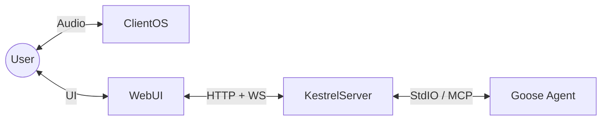

# Architecture: Kestrel

## Overview

Kestrel is a voice-first software development interface. The UI presents full technical detail, while the spoken channel delivers concise summaries suited for audio consumption. This document captures both the current baseline and the target architecture.

The system follows a pipeline architecture, wrapping the `goose` CLI process by default. It avoids modifying `goose` core directly, ensuring compatibility with future updates.



## Components

### 1. The Core: Goose Agent
*   **Role**: The "Brain". Handles tool use, file editing, and reasoning.
*   **Integration**: We run `goose` as a subprocess via a Runner interface.
*   **Communication**:
    *   **Input**: Standard Input (stdin) for user prompts.
    *   **Output**: Standard Output (stdout) for text responses.
    *   **Future**: Potential integration via MCP (Model Context Protocol) if `goose` exposes a server mode suitable for this.

### 2. Orchestrator (Session Core)
*   **Role**: Owns session state, transcripts, and tool context.
*   **Model Routing**: Assigns responsibilities to controller/coder/summarizer roles.
*   **Stream Framing**: Emits structured records for UI and speech layers.

### 3. Speech-to-Text (STT)
*   **Baseline**: Browser/OS speech recognition on the client device.
*   **Why**: Keeps speech capture local to the user, reduces server complexity, and aligns with the web UI.
*   **Target**: Optionally allow server-side STT for environments without reliable client STT.

### 4. Text-to-Speech (TTS)
*   **Baseline**: Browser/OS speech synthesis on the client device.
*   **Why**: Keeps playback local, reduces latency, and supports mobile/desktop without extra server models.
*   **Target**: Optional server-side TTS for consistent voice or offline use.

### 5. Tooling Layer (MCP Gateway)
*   **Registry**: Tools are described with metadata, permissions, and session scoping.
*   **Invocation**: Each call is a structured event with input/output boundaries.
*   **Transport**: Tools can be local, remote, or containerized.

### 6. Model Roles
*   **Controller (Planner)**: Converts spoken intent into a plan and tool requests.
*   **Coder (Executor)**: Implements code changes, executes tools, and interprets results.
*   **Summarizer (Recap)**: Produces the end-of-task recap in the format:
    *   "I did ...", "I learned ...", "Next ..."

## Voice-First UX Contract
*   **Spoken channel**: concise recaps, progress updates, and clarifying questions.
*   **Visual channel**: full logs, tool outputs, and code blocks for review.
*   **Speech safety**: avoid reading raw tool output; use short placeholders.

## Conversational Orchestration (Phase 2)
Beyond summaries, Kestrel should support a back-and-forth dialog about the work:
*   **Clarifying intent**: The orchestrator asks short questions to refine goals before execution.
*   **On-demand detail**: The user can request specific details (e.g., “read the script”) and the orchestrator provides the relevant content in speech-friendly form.
*   **Context-aware follow-ups**: The orchestrator can explain what was done and propose next steps, not just recite a summary.

## Project Memory & RAG Context
*   **Project Memory**: Maintain a project-local record of architecture decisions, tasks, and status. This is used by the orchestrator as a durable “what we’re building” context.
*   **Transcripts**: Session transcripts are stored alongside the project code (not in global workspace) so they can be mined for intent, corrections, and decisions.
*   **Retrieval**: The controller can retrieve relevant snippets from project memory/transcripts to ground clarifying questions and summaries.

## Data Flow (Baseline)

1.  **Speech Input**:
    *   The browser captures speech and transcribes to text using OS-provided STT.
    *   The UI sends text to the server via WebSocket.
2.  **Agent Processing**:
    *   Kestrel forwards text to Goose over stdin.
    *   Goose emits output over stdout/stderr, streamed back to the UI.
3.  **UI Rendering**:
    *   The UI renders full text, code blocks, and tool outputs in the chat view.
4.  **Speech Output**:
    *   The UI requests a summary from `/summarize` at end-of-turn.
    *   The UI speaks the summary using browser/OS TTS.

## Data Flow (Target)

1.  **Speech Input**: Client STT produces text; server optionally validates/normalizes.
2.  **Controller Planning**: Controller role produces a plan and tool requests.
3.  **Execution**: Coder role executes, tools run through MCP gateway.
4.  **Stream Framing**: Server emits framed records for UI rendering and summarizer.
5.  **Speech Output**: Summarizer emits a recap; UI speaks it.

## Stream Framing & Transcript
*   Every output segment is framed with:
    *   `type`: assistant | tool | system | summary
    *   `role`: controller | coder | summarizer
    *   `content`: full text
    *   `metadata`: timestamps, tool identifiers, status
*   Transcripts are stored per session inside the project tree for replay, debugging, and RAG context.

## Multi-Tenant Readiness
*   **Tenant Isolation**: Sessions, transcripts, and tool scopes must be isolatable per tenant.
*   **Access Control**: Orchestrator and MCP tools must enforce per-tenant permissions.
*   **Future Requirement**: Architecture must allow multi-tenant hosting without changing core session semantics.

## Testing & Validation
*   Stream integrity tests: ordered, framed output with no resets.
*   Summarizer tests: validate the recap format and tool/code mentions.
*   MCP tests: validate tool scoping and permissions.

## Directory Structure Plan

```
/
├── README.md
├── ARCHITECTURE.md
├── piper-data/       # Existing TTS models
├── src/
│   ├── main.py       # Entry point
│   ├── stt.py        # Whisper wrapper
│   ├── tts.py        # Piper wrapper
│   ├── bridge.py     # Goose subprocess manager
│   └── audio.py      # Mic/Speaker handling
└── requirements.txt
```
