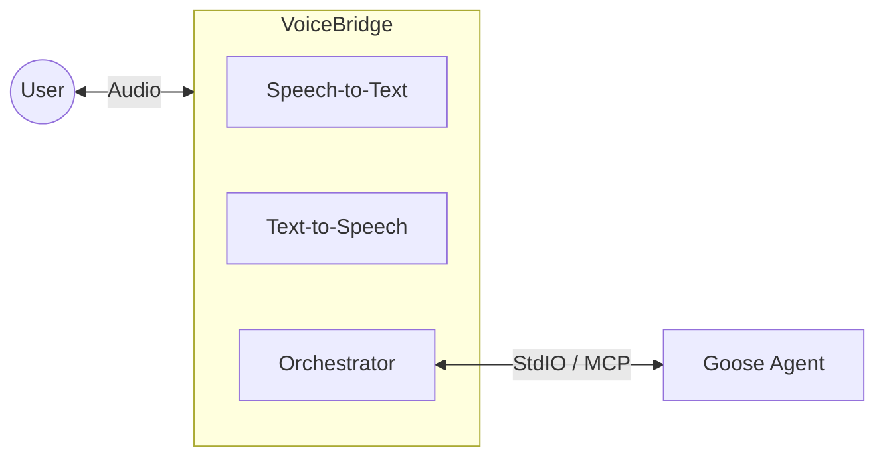

# Architecture: Kestrel

## Overview

The system follows a pipeline architecture, wrapping the `goose` CLI process. It avoids modifying `goose` core directly, ensuring compatibility with future updates.



## Components

### 1. The Core: Goose Agent
*   **Role**: The "Brain". Handles tool use, file editing, and reasoning.
*   **Integration**: We run `goose` as a subprocess.
*   **Communication**:
    *   **Input**: Standard Input (stdin) for user prompts.
    *   **Output**: Standard Output (stdout) for text responses.
    *   **Future**: Potential integration via MCP (Model Context Protocol) if `goose` exposes a server mode suitable for this, but CLI wrapping is the immediate path.

### 2. Speech-to-Text (STT)
*   **Engine**: `faster-whisper` (Python implementation of Whisper).
*   **Why**: fast, accurate, runs locally (privacy + speed).
*   **Config**: Use `small.en` or `base.en` models for low latency.

### 3. Text-to-Speech (TTS)
*   **Engine**: `piper` (https://github.com/rhasspy/piper).
*   **Why**: Extremely fast, low resource usage, runs locally, high quality.
*   **Models**: `.onnx` based voices (e.g., `en_US-lessac-medium`).
*   **Data**: Existing models located in `piper-data/` directory.

### 4. Orchestrator (The Bridge)
*   **Language**: Python.
*   **Responsibilities**:
    *   **Audio Input**: Capture microphone stream (using `PyAudio` or `sounddevice`).
    *   **VAD (Voice Activity Detection)**: Use `silero-vad` or `webrtcvad` to detect speech segments and avoid sending silence to STT.
    *   **Process Management**: Spawn and monitor the `goose` subprocess.
    *   **Text Processing**: Clean up `goose` output (e.g., remove progress bars or raw JSON logs) before sending to TTS.

## Data Flow

1.  **Listening**:
    *   Mic input is buffered.
    *   VAD detects speech start/end.
    *   On "Speech End", buffer is sent to STT.
2.  **Transcribing**:
    *   STT engine converts audio buffer to string.
    *   String is logged to console and written to `goose` stdin.
3.  **Processing (Goose)**:
    *   `goose` executes commands, thinks, and prints text.
4.  **Speaking**:
    *   Orchestrator reads `goose` stdout line-by-line.
    *   Text is accumulated until a sentence boundary (.!?) or pause.
    *   Sentence is sent to TTS.
    *   TTS generates audio.
    *   Audio is played immediately.

## Directory Structure Plan

```
/
├── README.md
├── ARCHITECTURE.md
├── piper-data/       # Existing TTS models
├── src/
│   ├── main.py       # Entry point
│   ├── stt.py        # Whisper wrapper
│   ├── tts.py        # Piper wrapper
│   ├── bridge.py     # Goose subprocess manager
│   └── audio.py      # Mic/Speaker handling
└── requirements.txt
```
