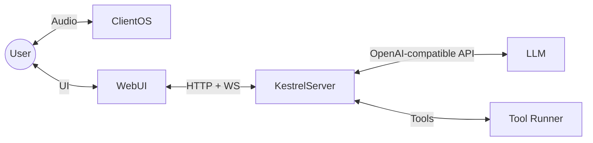

# Architecture: Kestrel

## Overview

Kestrel is a voice-first software development interface. The UI presents full technical detail, while the spoken channel delivers concise, high-signal summaries suited for audio consumption. This document captures the current baseline and the target architecture aligned with `OVERVIEW_OF_KESTREL_GOALS.md` and `KESTREL_INTERFACE_NOTES.md`.

Kestrel’s core is an LLM + tool loop. The system does not insert content into the conversation beyond required orchestration; it forwards user intent, executes tool calls, and only speaks the end-of-phase summary or clarifying questions.



## Components

### 1. The Core: LLM + Tool Loop
*   **Role**: The primary coding agent. It plans, requests tools, and produces the final response.
*   **Integration**: OpenAI-compatible API (llama.cpp by default).
*   **Contract**:
    *   The LLM outputs either a tool call or a final response.
    *   Tool results are injected back into the LLM as ground truth.
    *   Kestrel does not fabricate tool output or modify intent.

### 2. Orchestrator (Session Core)
*   **Role**: Owns session state, transcripts, and tool context.
*   **Model Routing**: Coordinates planner + executor + summarizer roles.
*   **Stream Framing**: Emits structured records for UI rendering and speech gating.

### 3. Speech-to-Text (STT)
*   **Baseline**: Browser/OS speech recognition on the client device.
*   **Why**: Keeps speech capture local to the user, reduces server complexity, and aligns with the web UI.
*   **Target**: Optionally allow server-side STT for environments without reliable client STT.

### 4. Text-to-Speech (TTS)
*   **Baseline**: Browser/OS speech synthesis on the client device.
*   **Why**: Keeps playback local, reduces latency, and supports mobile/desktop without extra server models.
*   **Target**: Optional server-side TTS for consistent voice or offline use.

### 5. Tooling Layer
*   **Registry**: Tools are described with metadata, permissions, and session scoping.
*   **Invocation**: Each call is a structured event with input/output boundaries.
*   **Transport**: Tools can be local, remote, or containerized.

### 6. Model Roles
*   **Controller (Planner)**: Converts spoken intent into a plan and tool requests.
*   **Coder (Executor)**: Implements code changes, executes tools, and interprets results.
*   **Summarizer (Recap)**: Produces the end-of-task recap in the format:
    *   "I did ...", "I learned ...", "Next ..."

## Voice-First UX Contract
*   **Spoken channel**: only final answers, summaries, and clarifying questions.
*   **Visual channel**: full logs, tool outputs, and code blocks for review.
*   **Speech safety**: avoid reading raw tool output; speak summaries of results.
*   **Tight loop**: user prompt → LLM plan/tool use → end-of-phase summary → user confirmation.

## Conversational Orchestration (Phase 2)
Beyond summaries, Kestrel should support a back-and-forth dialog about the work:
*   **Clarifying intent**: The orchestrator asks short questions to refine goals before execution.
*   **On-demand detail**: The user can request specific details (e.g., “read the script”) and the orchestrator provides the relevant content in speech-friendly form.
*   **Context-aware follow-ups**: The orchestrator can explain what was done and propose next steps, not just recite a summary.

## Project Memory & RAG Context
*   **Project Memory**: Maintain a project-local record of architecture decisions, tasks, and status. This is used by the orchestrator as a durable “what we’re building” context.
*   **Transcripts**: Session transcripts are stored alongside the project code (not in global workspace) so they can be mined for intent, corrections, and decisions.
*   **Retrieval**: The controller can retrieve relevant snippets from project memory/transcripts to ground clarifying questions and summaries.

## Data Flow (Baseline)

1.  **Speech Input**:
    *   The browser captures speech and transcribes to text using OS-provided STT.
    *   The UI sends text to the server via WebSocket.
2.  **LLM Processing**:
    *   Kestrel forwards text to the LLM.
    *   The LLM emits tool calls or a final response.
3.  **Tool Execution**:
    *   Kestrel executes tool calls and feeds results back to the LLM.
4.  **UI Rendering**:
    *   The UI renders the full stream (thoughts, tool results, code, logs).
5.  **Speech Output**:
    *   Kestrel emits a summary or clarifying question.
    *   The UI speaks only those summaries/questions.

## Data Flow (Target)

1.  **Speech Input**: Client STT produces text; server optionally validates/normalizes.
2.  **Controller Planning**: Controller role produces a plan and tool requests.
3.  **Execution**: Coder role executes, tools run through MCP gateway.
4.  **Stream Framing**: Server emits framed records for UI rendering and summarizer.
5.  **Speech Output**: Summarizer emits a recap; UI speaks it.

## Stream Framing & Transcript

> **See [docs/SESSION_CAPTURE.md](docs/SESSION_CAPTURE.md) for complete capture architecture.**

Every output segment is framed with:
*   `ts`: ISO 8601 timestamp
*   `type`: stt_raw | user_intent | agent_stream | tool_call | tool_result | summary | system
*   `source`: whisper | browser_stt | controller | coder | summarizer | tool_runner | system
*   `body_b64`: base64-encoded content
*   `meta`: type-specific metadata (tool names, file lists, task IDs, etc.)

### Capture Layers
1. **JSONL Transcripts** - Primary structured format at `{project}/.kestrel/{branch}.jsonl`
2. **Markdown Notes** - Human-readable summaries at `{project}/.kestrel/notes/{branch}/{date}.md`
3. **Future: Vector DB** - RAG-ready chunks derived from JSONL

### Key Event Types
*   `stt_raw`: Raw speech-to-text with audio metadata and confidence
*   `user_intent`: Interpreted user request (may differ from raw STT)
*   `agent_stream`: Full stdout/stderr from backend coding agents
*   `tool_call`/`tool_result`: Tool invocations and their outputs
*   `summary`: End-of-task recap (what gets spoken to user)

## Multi-Tenant Readiness
*   **Tenant Isolation**: Sessions, transcripts, and tool scopes must be isolatable per tenant.
*   **Access Control**: Orchestrator and MCP tools must enforce per-tenant permissions.
*   **Future Requirement**: Architecture must allow multi-tenant hosting without changing core session semantics.

## Testing & Validation
*   Stream integrity tests: ordered, framed output with no resets.
*   Summarizer tests: validate the recap format and tool/code mentions.
*   MCP tests: validate tool scoping and permissions.

## Directory Structure (Current)

```
/
├── ARCHITECTURE.md
├── KESTREL_INTERFACE_NOTES.md
├── src/
│   ├── server.py         # HTTP + WS API + orchestration loop
│   ├── agent_runner.py   # LLM + tool loop
│   ├── agent_tools.py    # Tool registry + execution
│   ├── agent_session.py  # Session context
│   └── session_manager.py
├── ui/
│   └── web/              # React UI
└── tests/
```
